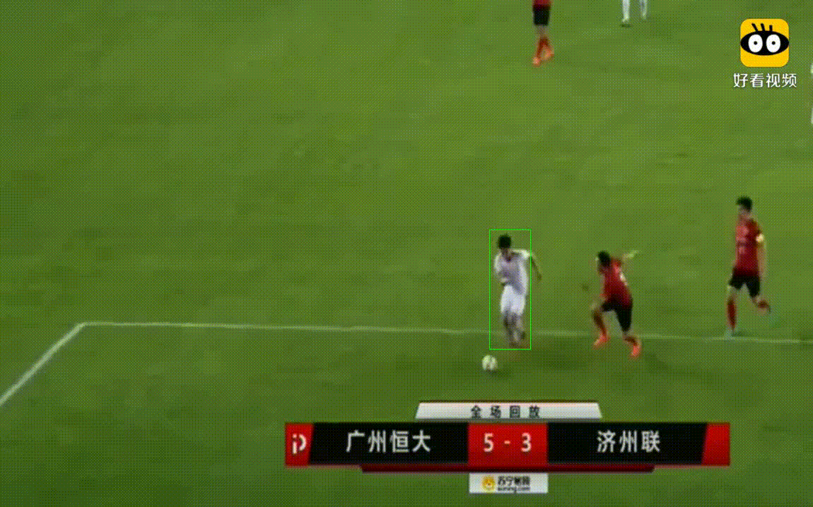

# Introduction

Video_Object_Tracking.py: the example from Dlib official document 
frame2jpg.py: Process the video stream into a picture frame by frame,which are used by Video_Object_Tracking.py

objectTracking.py: my way to track object 
mouse_draw.py: circle out the object 
frames2mp4.py: save the frame as mp4

## result example

